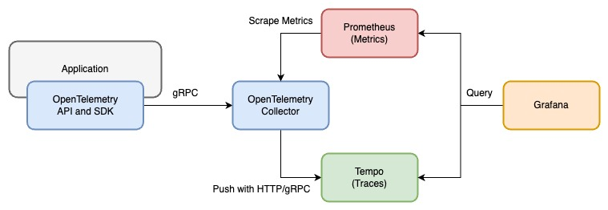
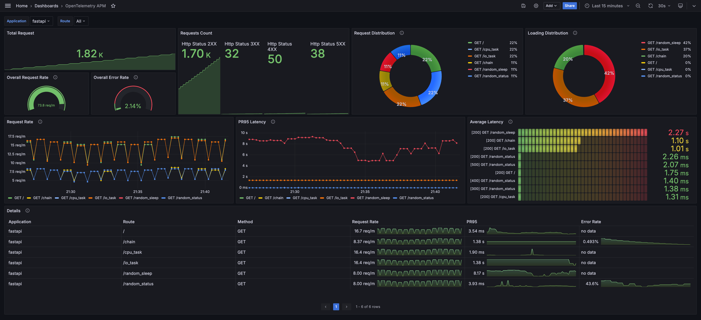

# OpenTelemetry Application Performance Management

Monitoring application performance with OpenTelemetry SDK, OpenTelemetry Collector, Prometheus, and Grafana:

1. OpenTelemetry SDK: Generate traces and push them to OpenTelemetry Collector with [zero-code instrumentation](https://opentelemetry.io/docs/concepts/instrumentation/zero-code/)
2. OpenTelemetry Collector: Receive traces and process them to metrics with [Span Metrics Connector](https://github.com/open-telemetry/opentelemetry-collector-contrib/blob/main/connector/spanmetricsconnector/README.md)
3. Prometheus: Scrape metrics from OpenTelemetry Collector
4. Grafana: Visualize metrics
5. Tempo: Collect traces, optional for the main goal to process traces to metrics



This project is inspired by [Jaeger Service Performance Monitoring](https://www.jaegertracing.io/docs/1.47/spm/).

## Quick Start

1. Start all services with docker-compose

   ```bash
   docker-compose up -d
   ```

   This project includes FastAPI(Python) and Spring Boot(Java) to demonstrate the out-of-the-box ability of OpenTelemetry zero-code instrumentation. Comment out the services you don't want to run in `docker-compose.yml`.

2. Send requests with [siege](https://linux.die.net/man/1/siege) to the applications:

   ```bash
   bash request-script.sh
   ```

   Or you can send requests with [k6](https://k6.io/):

   ```bash
   k6 run --vus 3 --duration 300s k6-script.js
   ```

3. Login to Grafana([http://localhost:3000/](http://localhost:3000/)) with default admin user and check the predefined dashboard `OpenTelemetry APM`

   - Username: `admin`
   - Password: `admin`

   Dashboard screenshot:

   

   This dashboard is also available on [Grafana Dashboards](https://grafana.com/grafana/dashboards/19419).

## Detail

### OpenTelemetry Zero Instrumentation

OpenTelemetry provides two ways to instrument your application:

1. [Code-based Instrumentation](https://opentelemetry.io/docs/concepts/instrumentation/code-based/): Modify the application codebase to create spans and export them.
2. [Zero-code Instrumentation](https://opentelemetry.io/docs/concepts/instrumentation/zero-code/): Utilize the mechanism from the language runtime to inject code into the application to create spans and export them without modifying the application codebase.

In this project, we use zero-code instrumentation to instrument the applications.

#### Java - Spring Boot

[OpenTelemetry Instrumentation for Java](https://github.com/open-telemetry/opentelemetry-java-instrumentation) provides an [zero-code way](https://opentelemetry.io/docs/zero-code/java/agent/)(Java 1.8+ is required) to instrument the application by the agent jar as follows:

```bash
java -javaagent:path/to/opentelemetry-javaagent.jar -jar myapp.jar
```

The agent supports a lot of [libraries](https://github.com/open-telemetry/opentelemetry-java-instrumentation/blob/main/docs/supported-libraries.md), including Spring Web MVC. According to the document:

> It can be used to capture telemetry data at the “edges” of an app or service, such as inbound requests, outbound HTTP calls, database calls, and so on.

So we don't need to modify any line of code in our codebase. The agent will handle everything automatically.

The configurations, like the exporter setting, are listed on the [document](https://opentelemetry.io/docs/languages/java/configuration/), and are consumed by the agent from one or more of the following sources (ordered from highest to lowest priority):

- system properties
- environment variables
- the configuration file
- the [ConfigPropertySource](https://opentelemetry.io/docs/languages/java/configuration/#customizing-the-opentelemetry-sdk) SPI

In this project we use environment variables to set the agent configuration:

```yaml
# docker-compose.yml
spring-boot:
  image: ghcr.io/blueswen/opentelemetry-apm/springboot:latest
  environment:
    - OTEL_EXPORTER=otlp_span
    - OTEL_EXPORTER_OTLP_ENDPOINT=http://otel-collector:4317
    - OTEL_EXPORTER_OTLP_INSECURE=true
    - OTEL_METRICS_EXPORTER=none
    - OTEL_RESOURCE_ATTRIBUTES=service.name=sprint-boot
  command: "java -javaagent:/opentelemetry-javaagent.jar -jar /app.jar"
```

Check [Spring Boot with Observability](https://github.com/blueswen/spring-boot-observability) for more details, if you are interested in Spring Boot with Observability.

#### Python - FastAPI

[OpenTelemetry Instrumentation for Python](https://github.com/open-telemetry/opentelemetry-python-contrib/tree/main/opentelemetry-instrumentation) provides an [zero-code way](https://opentelemetry.io/docs/zero-code/python/) for [multiple libraries and frameworks](https://github.com/open-telemetry/opentelemetry-python-contrib/tree/main/instrumentation) to instrument the application. With zero-code instrumentation, it will inject bytecode dynamically to gather telemetry.

For using zero-code instrumentation, we need to install at least three packages:

1. [opentelemetry-distro](https://github.com/open-telemetry/opentelemetry-python-contrib/tree/main/opentelemetry-distro): OpenTelemetry API and SDK
2. [opentelemetry-exporter](https://github.com/open-telemetry/opentelemetry-python/tree/main/exporter): Exporter for traces and metrics which have to correspond to the exporter setting of the agent, we use [opentelemetry-exporter-otlp](https://github.com/open-telemetry/opentelemetry-python/tree/main/exporter/opentelemetry-exporter-otlp) here
3. [opentelemetry-instrumentation](https://github.com/open-telemetry/opentelemetry-python-contrib/tree/main/instrumentation): Provides instrumentation for various libraries and frameworks. There are two methods for installation:
   1. Direct installation of the instrumentation package, for example, [opentelemetry-instrumentation-fastapi](https://github.com/open-telemetry/opentelemetry-python-contrib/tree/main/instrumentation/opentelemetry-instrumentation-fastapi), [opentelemetry-instrumentation-requests](https://github.com/open-telemetry/opentelemetry-python-contrib/tree/main/instrumentation/opentelemetry-instrumentation-requests), [opentelemetry-instrumentation-httpx](https://github.com/open-telemetry/opentelemetry-python-contrib/tree/main/instrumentation/opentelemetry-instrumentation-httpx), etc.
   2. Alternatively, use the [opentelemetry-bootstrap](https://github.com/open-telemetry/opentelemetry-python-contrib/tree/main/opentelemetry-instrumentation#opentelemetry-bootstrap) command from opentelemetry-instrumentation. Execute `opentelemetry-bootstrap -a install` to automatically install all available instrumentation libraries based on the currently installed libraries and frameworks. In this project, we utilize this method to install all available instrumentation libraries.

There are two ways to set the configuration of OpenTelemetry Instrumentation for Python:

1. [Environment variables](https://opentelemetry-python-contrib.readthedocs.io/en/latest/instrumentation/fastapi/fastapi.html#environment-variables)
2. [CLI arguments](https://github.com/open-telemetry/opentelemetry-python-contrib/tree/main/opentelemetry-instrumentation#opentelemetry-instrument)

In this project we use environment variables to set the zero-code instrumentation configuration:

```yaml
# docker-compose.yml
fastapi:
  image: ghcr.io/blueswen/opentelemetry-apm/fastapi:latest
  environment:
    - OTEL_TRACES_EXPORTER=otlp
    - OTEL_EXPORTER_OTLP_ENDPOINT=http://otel-collector:4317
    - OTEL_METRICS_EXPORTER=none
    - OTEL_SERVICE_NAME=fastapi
  command: "opentelemetry-instrument python main.py"
```

Here is a sample command with CLI arguments:

```bash
opentelemetry-instrument \
    --traces_exporter otlp \
    --metrics_exporter none \
    --service_name fastapi \
    --exporter_otlp_endpoint http://otel-collector:4317 \
    python main.py
```

Check [FastAPI with Observability](https://github.com/blueswen/fastapi-observability) for more details, if you are interested in FastAPI with Observability.

#### JavaScript - Express

[OpenTelemetry Javascript Contrib](https://github.com/open-telemetry/opentelemetry-js-contrib) provides an [zero-code way](https://opentelemetry.io/docs/zero-code/js/) to instrument the application for multiple Node.js [frameworks and libraries](https://github.com/open-telemetry/opentelemetry-js-contrib/tree/main/metapackages/auto-instrumentations-node#supported-instrumentations).

To use zero-code instrumentation, we need to install two packages:

1. [@opentelemetry/api](https://www.npmjs.com/package/@opentelemetry/api)
2. [@opentelemetry/auto-instrumentations-node](https://www.npmjs.com/package/@opentelemetry/auto-instrumentations-node): Zero-code instrumentation was formerly known as automatic instrumentation, so the package name is `auto-instrumentations-node`.

Then, we can use the environment variables to config the zero-code instrumentation and use the `require` argument to load the auto-instrumentations:

```bash
export OTEL_TRACES_EXPORTER=otlp
export OTEL_EXPORTER_OTLP_ENDPOINT=http://otel-collector:4317
export OTEL_EXPORTER_OTLP_PROTOCOL=grpc
export OTEL_SERVICE_NAME=express
node --require @opentelemetry/auto-instrumentations-node app.js
```

In this project we use environment variables to set the zero-code instrumentation configuration:

```yaml
# docker-compose.yml
express:
  image: ghcr.io/blueswen/opentelemetry-apm/express:latest
  environment:
    - OTEL_EXPORTER_OTLP_PROTOCOL=grpc
    - OTEL_EXPORTER_OTLP_ENDPOINT=http://otel-collector:4317
    - OTEL_SERVICE_NAME=express
  command: "node --require '@opentelemetry/auto-instrumentations-node/register' app.js"
```

Check more details about zero-code instrumentation in the [document](hhttps://opentelemetry.io/docs/zero-code/js/) and [GitHub Repo](https://github.com/open-telemetry/opentelemetry-js-contrib/tree/main/metapackages/auto-instrumentations-node#supported-instrumentations). The environment variables are listed in the [Java SDK configuration document](https://opentelemetry.io/docs/languages/java/configuration/).

#### .NET

Work in progress

#### Laravel - PHP

Work in progress

#### Ruby on Rails - Ruby

Work in progress

### OpenTelemetry Collector

OpenTelemetry Collector is a vendor-agnostic agent for collecting telemetry data, which can receive different telemetry data formats and export them to different backends. In this project, we use OpenTelemetry Collector to receive traces from the applications over OTLP and process them to metrics with [Span Metrics Connector](https://github.com/open-telemetry/opentelemetry-collector-contrib/blob/main/connector/spanmetricsconnector/README.md).

[Contrib distribution of OpenTelemetry Collector](https://github.com/open-telemetry/opentelemetry-collector-contrib) is required for the Span Metrics Connector feature. OpenTelemetry Collector only has the core components, and the Contrib distribution provides additional components, including the Span Metrics Connector.

```yaml
# docker-compose.yml
otel-collector:
  image: otel/opentelemetry-collector-contrib:0.91.0 # Use Contrib distribution
  command:
    - "--config=/conf/config.yaml"
  volumes:
    - ./etc/otel-collector-config.yaml:/conf/config.yaml
  ports:
    - "4317" # OTLP gRPC receiver
    - "4318" # OTLP http receiver
    - "8889" # Prometheus metrics exporter port
  restart: on-failure
  depends_on:
    - tempo
```

To enable Span Metrics Connector and expose metrics in Prometheus format, we need to:

1. Add `spanmetrics` to `connectors`: Enable and configure the spanmetrics connector
   1. dimensions: Extract span attributes to Prometheus labels
2. Add `spanmetrics` to traces pipeline `exporters`: Let the traces pipeline export traces to the spanmetrics connector
3. Add `spanmetrics` to metrics pipeline `receivers`: Set the spanmetrics connector as the receiver of the metrics pipeline, and the data is from the traces pipeline exporter
4. Add `prometheus` to metrics pipeline `exporters`: Expose metrics in Prometheus format on port 8889

The pipeline diagram and configuration file are as follows:


```yaml
# etc/otel-collector-config.yaml
receivers:
  otlp:
    protocols:
      grpc: # enable gRPC protocol, default port 4317
      http: # enable http protocol, default port 4318

exporters:
  otlp:
    endpoint: tempo:4317
    tls:
      insecure: true
  prometheus:
    endpoint: "0.0.0.0:8889" # expose metrics on port 8889

connectors:
  spanmetrics:
    dimensions:
      - name: http.method # extract http.method attribute from span to Prometheus label http_method
      - name: http.status_code  # extract http.status_code attribute from span to Prometheus label http_status_code
      - name: http.route  # extract http.route attribute from span to Prometheus label http_route

processors:
  batch: # Compress spans into batches to reduce network traffic 

service:
  pipelines:
    traces:
      receivers: [otlp]
      processors: [batch]
      exporters: [spanmetrics, otlp]
    metrics/spanmetrics:
      receivers: [spanmetrics]
      exporters: [prometheus]
```

Since opentelemetry-collector-contrib 0.85.0 the histogram metrics of duration be renamed from `duration_count` to `duration_milliseconds_count` or `duration_seconds_count` according to the unit of the metrics. Ensure the version of opentelemetry-collector-contrib is 0.85.0+ if you want to use the predefined dashboard in this project.

Check more details about Connector in the [document](https://opentelemetry.io/docs/collector/configuration/#connectors).

### Prometheus

OpenTelemetry Collector only provides metrics in Prometheus format, so we need to use Prometheus to scrape metrics from OpenTelemetry Collector.

```yaml
# docker-compose.yml
prometheus:
  image: prom/prometheus:v2.48.1
  ports:
    - "9090:9090"
  volumes:
    - ./etc/prometheus.yml:/workspace/prometheus.yml
  command:
    - --config.file=/workspace/prometheus.yml
```

Add OpenTelemetry Collector as a scrape target in the Prometheus config file:

```yaml
# etc/prometheus.yml
scrape_configs:
  - job_name: aggregated-trace-metrics
    static_configs:
    - targets: ['otel-collector:8889']
```

### Tempo

In this project, Tempo is used as a backend for receiving traces from OpenTelemetry Collector, and it is optional for the main goal to process traces to metrics. You can also use Jaeger as a backend.

```yaml
# docker-compose.yml
tempo:
  image: grafana/tempo:2.3.1
  command: [ "--target=all", "--storage.trace.backend=local", "--storage.trace.local.path=/var/tempo", "--auth.enabled=false" ]
  ports:
    - "14250:14250"
```

### Grafana

We use [Sparkline feature](https://grafana.com/docs/grafana/latest/panels-visualizations/visualizations/table/#sparkline) to visualize the metrics in the table panel. This feature is available in Grafana 9.5+ as an opt-in beta feature, and needs to be enabled with an environment variable or in the configuration file `grafana.ini`:

```ini
[feature_toggles]
enable = timeSeriesTable
```


- Add Prometheus and Tempo to the data source with config file `etc/grafana/datasource.yml`.
- Load predefined dashboard with `etc/dashboards.yaml` and `etc/dashboards/fastapi-observability.json`.

```yaml
# grafana in docker-compose.yaml
grafana:
   image: grafana/grafana:10.3.1
   volumes:
      - ./etc/grafana/:/etc/grafana/provisioning/datasources # data sources
      - ./etc/dashboards.yaml:/etc/grafana/provisioning/dashboards/dashboards.yaml # dashboard setting
      - ./etc/dashboards:/etc/grafana/dashboards # dashboard json files directory
   environment:
      GF_AUTH_ANONYMOUS_ENABLED: "true"
      GF_AUTH_ANONYMOUS_ORG_ROLE: "Admin"
      GF_FEATURE_TOGGLES_ENABLE: "timeSeriesTable" # enable sparkline feature
```

## Reference

1. [Official Jaeger with SPM docker compose example](https://github.com/jaegertracing/jaeger/tree/main/docker-compose/monitor)
2. [Difference between OpenTelemetry Collector and OpenTelemetry Collector Contrib](https://uptrace.dev/opentelemetry/collector.html#otelcol-vs-otelcol-contrib)
3. [The RED Method: key metrics for microservices architecture](https://www.weave.works/blog/the-red-method-key-metrics-for-microservices-architecture/)


Changing the grafana to WL product with name Serversage:

0. run ./deploy.sh

1. Build the Docker image :
docker build -t serversage .

docker tag serversage:latest aniketxshinde/serversage:latest
docker tag opentelemetry-apmcopy-spring-boot aniketxshinde/serversage:0.1.0

docker tag opentelemetry-apm_backup-spring-boot-user aniketxshinde/serversage:0.1.1
docker tag spring-boot-user-with-db-spring-boot:latest aniketxshinde/serversage:0.1.2

docker login

username: abc // your username of git
pass: abc // your password of git

docker push aniketxshinde/serversage:0.1.0
docker push aniketxshinde/serversage:0.1.1
docker push aniketxshinde/serversage:0.1.2

2. Save the Docker image to a .tar archive:
docker save -o serversage.tar serversage:latest

3. (Optional) Compress the .tar archive You can further compress the .tar archive using gzip to reduce its size7:
docker save serversage:latest | gzip > serversage.tar.gz

4. Loading the image from the .tar archive To load the image from the .tar archive, use the docker load command58:
docker load -i serversage.tar


docker system prune -a

docker builder prune
docker container prune
docker volume prune
## stop & Remove All Containers
docker stop $(docker ps -a -q) && docker rm $(docker ps -a -q)

docker load -i java-apm-springboot-docker.tar

scp otel-springboot.tar ubuntu@serversagedemo.remiges.tech:/serversage-demo/java-apm

docker save -o java-apm-springboot-docker.tar ghcr.io/blueswen/opentelemetry-apm/springboot:latest
